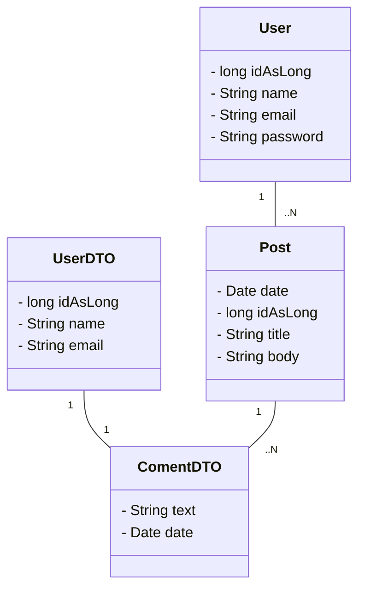

# Workshop_MongoDB

 The biggest challenge of this project was to transform the id of the document that was in timestamp format to a Long. I couldn't get support in the mongo db database for this automatic conversion, so I created the MongoComponent and ConfigurationMongo classes to accomplish this task. 

 The project is a small fraction of how a social network works, with users, posts and comments. 

<h1> Class Diagram </h1>

